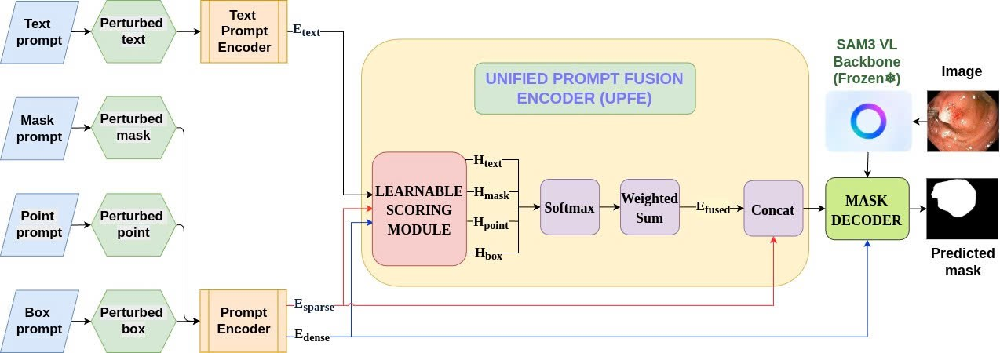

# UMPA-SAM

**UMPA-SAM: Unified Multi-Prompt Adaptation for Robust Polyp Segmentation**

---

## Overview

UMPA-SAM is a research framework that adapts the [Segment Anything Model (SAM)](https://github.com/facebookresearch/segment-anything) for **robust polyp segmentation** in colonoscopy images. The framework is designed to handle imprecise, inconsistent, or incomplete prompt inputs that commonly occur in clinical settings.

The model accepts multiple prompt modalities — **bounding box, point, mask, and text** — and produces stable, high-quality segmentation masks even under prompt variability.

> **Note:** Model architecture details are currently withheld and will be released upon publication.

## Model Architecture



---

## Key Features

- **Multi-modal prompt support**: bounding box, point, mask, and text prompts  
- **Robust to prompt noise**: handles clinical annotation imperfections  
- **Built on SAM3**: leverages Segment Anything Model v3 as backbone  
- **Three-phase training strategy**: phased optimization schedule for stable convergence  
- **Multi-dataset support**: evaluated on 5 standard polyp benchmarks  

---

## Project Structure

```
sam3/                          # Project root
├── main.py                    # Training script
├── requirements.txt           # Python dependencies
│
├── umpt_sam/                  # Core framework
│   ├── config/                # Configuration dataclasses
│   │   ├── model_config.py    # Model hyperparameters
│   │   └── train_config.py    # 3-phase training schedule
│   ├── data/                  # Dataset loading & transforms
│   │   ├── dataset_registry.py   # 5-dataset registry
│   │   ├── polyp_dataset.py      # PolypDataset class
│   │   └── polyp_transforms.py   # Albumentations pipelines
│   ├── losses/                # Loss functions
│   ├── modules/               # Model components (withheld)
│   ├── training/              # Trainer, evaluator, schedulers
│   └── umpa_model.py          # Model entry point (withheld)
│
├── sam3/                      # SAM3 backbone (third-party)
└── model_trained/             # Pre-trained checkpoints directory
```

---

## Requirements

| Component | Minimum Version |
|-----------|----------------|
| Python    | ≥ 3.10         |
| PyTorch   | ≥ 2.0          |
| CUDA      | ≥ 12.4 (recommended) |
| GPU VRAM  | ≥ 16 GB (recommended) |

---

## Installation

### 1. Clone the repository

```bash
git clone https://github.com/TongDuyDat/UMPA-SAM.git
cd UMPA-SAM
```

### 2. Create conda environment

```bash
conda create -n umpa_sam python=3.10 -y
conda activate umpa_sam
pip install -r requirements.txt
```

### 3. Download SAM3 checkpoint

Download the SAM3 pre-trained checkpoint from [Hugging Face](https://huggingface.co/facebook/sam3.1) and place it at `model_trained/sam3.pt`.

**Using CLI:**

```bash
mkdir -p model_trained
# Option 1: Using huggingface-cli
pip install huggingface_hub
huggingface-cli download facebook/sam3.1 sam3.pt --local-dir model_trained/

# Option 2: Using wget (direct link)
wget -O model_trained/sam3.pt https://huggingface.co/facebook/sam3.1/resolve/main/sam3.pt
```

> **Note:** You may need to accept the license on the [Hugging Face model page](https://huggingface.co/facebook/sam3.1) and log in via `huggingface-cli login` before downloading.

---

## Dataset Preparation

### Supported Datasets

| Name              | Registry Key     | Description                      |
|-------------------|------------------|----------------------------------|
| Kvasir-SEG        | `kvasir_seg`     | 1000 polyp images                |
| CVC-ClinicDB      | `cvc_clinicdb`   | 612 polyp images                 |
| CVC-ColonDB       | `cvc_colondb`    | 380 polyp images                 |
| CVC-300           | `cvc_300`        | 300 polyp images                 |
| ETIS-LaribPolypDB | `etis_larib`     | 196 polyp images                 |

### Download datasets

**Automatic download** (from Google Drive):

```bash
bash scripts/download_datasets.sh
```

**Manual download**: Place each dataset under `umpt_sam/data/` with this structure:

```
umpt_sam/data/
├── Kvasir_SEG/
│   ├── images/          # .jpg / .png images
│   └── masks/           # Corresponding binary masks
├── CVC-ClinicDB/
│   ├── images/
│   └── masks/
├── CVC-ColonDB/
│   ├── images/
│   └── masks/
├── CVC_300/
│   ├── images/
│   └── masks/
└── ETIS-Larib/
    ├── images/
    └── masks/
```

### Train/Val/Test splits

Splits are **auto-generated** the first time you run training or evaluation. The system creates `split/{train,val,test}.txt` inside each dataset folder with an 80/10/10 ratio (seed=42).

To manually generate splits for all datasets:

```python
from umpt_sam.data.dataset_registry import ensure_all_splits
ensure_all_splits()
```

---

## Training

### Quick Start — Single Dataset

```bash
python main.py
```

This trains on Kvasir-SEG with default hyperparameters using the 3-phase training schedule:

| Phase      | Epochs | Learning Rate | λ_con | Frozen Components                      |
|------------|--------|---------------|-------|----------------------------------------|
| Warmup     | 5      | 1e-4          | 0.0   | Image Encoder, Prompt Encoder, Mask Decoder |
| Adaptation | 5      | 5e-5          | 0.0   | Image Encoder, Mask Decoder            |
| Consistency| 10     | 1e-5          | 0.5   | Image Encoder                          |

### Dataset Configuration

In `main.py`, the dataset is configured through two components:

**1. Data source config** (e.g. `umpt_sam/data/kvasir_sessile.py`):

```python
DATASET_SOURCE = "<path_to_dataset_root>"    # absolute or relative path
IMAGE_SIZE = (1008, 1008)                    # input resolution
TRANSFORM_PIPELINE = { "train": ..., "val": ... }  # albumentations pipelines
```

**2. DatasetConfig** in `main.py`:

```python
from umpt_sam.data.polyp_dataset import DatasetConfig
from umpt_sam.data.<your_config> import DATASET_SOURCE, TRANSFORM_PIPELINE

dataset_config = DatasetConfig(root=DATASET_SOURCE)
```

#### Switching to a different dataset

1. Create a new config file under `umpt_sam/data/` (see `kvasir_sessile.py` as reference)
2. Set `DATASET_SOURCE` to your dataset root directory
3. Update the import in `main.py` to point to your new config

#### Expected dataset directory layout

```
umpt_sam/data/<DatasetName>/
├── images/          # .jpg / .png images
├── masks/           # binary masks (same filenames as images)
└── split/           # auto-generated on first run
    ├── train.txt    # file stems (80%)
    ├── val.txt      # (10%)
    └── test.txt     # (10%)
```

> Split files are **auto-generated** on the first training run with an 80/10/10 ratio (seed=42).

### Training Outputs

```
checkpoints/run_YYYYMMDD_HHMMSS/
├── best_model.pth          # Best validation checkpoint
├── latest_model.pth        # Latest checkpoint
└── training_log.txt        # Detailed training log
```

---

## Evaluation

### Evaluate a trained checkpoint

```python
from umpt_sam.training.evaluate import benchmark_test
from umpt_sam.config.model_config import UMPAModelConfig, UPFEConfig, MPPGConfig
from umpt_sam.data.polyp_dataset import DatasetConfig

model_config = UMPAModelConfig(
    sam_checkpoint="model_trained/sam3.pt",
    embed_dim=256, text_embed_dim=512,
    freeze_image_encoder=True,
    upfe=UPFEConfig(scoring_hidden_dim=256),
    mppg=MPPGConfig(),
)

dataset_config = DatasetConfig(root="umpt_sam/data/Kvasir_SEG")

metrics = benchmark_test(
    checkpoint_path="checkpoints/<run_dir>/best_model.pth",
    dataset_cfg=dataset_config,
    model_config=model_config,
    device="cuda",
    batch_size=4,
)

print(f"Dice: {metrics['dice']:.4f} | mIoU: {metrics['miou']:.4f}")
```

### Evaluation Metrics

| Metric       | Description                                 |
|--------------|---------------------------------------------|
| **Dice**     | Dice similarity coefficient                 |
| **mIoU**     | Mean Intersection over Union                |
| **Precision**| Pixel-level precision                       |
| **Recall**   | Pixel-level recall                          |
| **F2-Score** | F2 measure emphasizing recall               |
| **Mask AP**  | AP at IoU thresholds 0.50:0.05:0.95         |

---

## Results

*To be released upon publication.*

---

## Citation

*To be released upon publication.*

---

## Acknowledgments

This project uses [SAM 3 (Segment Anything Model)](https://github.com/facebookresearch/sam3) as its backbone. SAM 3 is developed by Meta AI and licensed under the [SAM License](LICENSE).

---

## License

This project is licensed under the terms of the [LICENSE](LICENSE) file.
