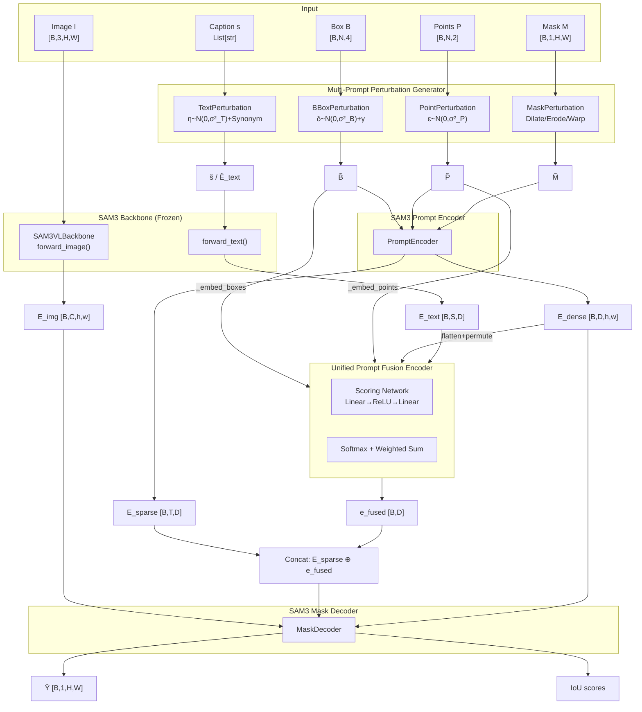
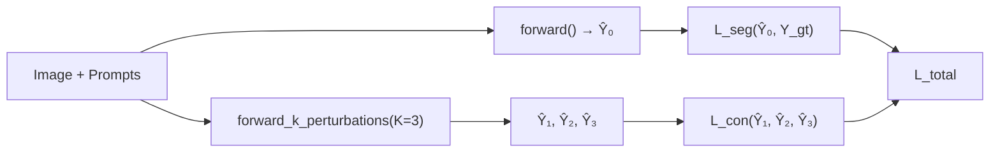

# UMPT-SAM Pipeline Analysis

## Symbol Table

| Paper Symbol | Code Variable | Shape | Description |
|---|---|---|---|
| $I$ | `image` | `[B, 3, H, W]` | Input colonoscopy image |
| $B$ | `bbox` / `boxes` | `[B, N, 4]` | Bounding box prompt (xyxy) |
| $P, L$ | `points`, `point_labels` | `[B, N, 2]`, `[B, N]` | Point prompts + labels |
| $M$ | `masks` | `[B, 1, H, W]` | Coarse mask prompt |
| $s$ | `captions` | `List[str]` | Text prompt (e.g. "polyp") |
| $E_{text}$ | `text_embeddings` | `[B, S, D_{text}]` | CLIP text embedding |
| $\tilde{B}$ | `boxes_p` | `[B, N, 4]` | Perturbed bounding box |
| $\tilde{P}$ | `points_p` | `[B, N, 2]` | Perturbed points |
| $\tilde{M}$ | `masks_p` | `[B, 1, H', W']` | Perturbed mask |
| $\tilde{E}_{text}$ | `text_emb_p` | `[B, S, D]` | Perturbed text embedding |
| $E_{img}$ | `image_embeddings` | `[B, C, h, w]` | SAM3 vision features |
| $E_{sparse}$ | `sparse_embs` | `[B, T, D]` | SAM prompt encoder output (sparse) |
| $E_{dense}$ | `dense_embs` | `[B, D, h, w]` | SAM prompt encoder output (dense) |
| $e_{fused}$ | `e_fused` | `[B, D]` | UPFE fused embedding |
| $w_t$ | `prompt_weights` | `[B, K, D]` | Attention weights from scoring network |
| $\hat{Y}$ | `pred_masks` | `[B, 1, H, W]` | Predicted segmentation mask |
| $K$ | `config.K` | scalar | Number of perturbation rounds |

---

## Architecture Overview



---

## Pipeline Stages (Detailed)

### Stage 1 — Data Loading ([polyp_dataset.py](file:///d:/NCKH/NCKH2025/polyp/sam3/umpt_sam/data/polyp_dataset.py))

`PolypDataset` reads image-mask pairs and generates all prompt modalities:

| Output Key | Shape | Generation Method |
|---|---|---|
| `image` | `(3,H,W)` float32 | `(pixel/127.5) - 1.0` → [-1,1] |
| `mask` | `(1,H,W)` float32 | Binary [0,1] |
| `bbox` | `(4,)` float32 | `_extract_bbox()` from GT mask contour (xyxy) |
| `points` | `(N,2)` float32 | Random sampling: 3 positive + 1 negative |
| `point_labels` | `(N,)` int64 | 1=foreground, 0=background |
| `text` | str | `"polyp in colonoscopy image"` |

Custom `collate_fn` pads variable-length point arrays across batch with label `-1` for padding.

---

### Stage 2 — Multi-Prompt Perturbation Generator (MPPG) ([modules.py](file:///d:/NCKH/NCKH2025/polyp/sam3/umpt_sam/modules/modules.py))

Only active during `model.training = True`. The `PromptPerturbation` wrapper dispatches to four sub-modules:

#### 2.1 BBoxPerturbation
$$\tilde{B} = B + \delta + \gamma, \quad \delta_i \sim \mathcal{N}(0, \sigma_B^2), \quad \gamma_i \sim \mathcal{U}(\gamma_{min}, \gamma_{max})$$
- Optional rotation: $\theta \sim \mathcal{U}(-3°, 3°)$, applied via corner rotation + re-axis-alignment
- Validity enforced: $x_1 < x_2, y_1 < y_2$
- Default: $\sigma_B = 5.0$, $\gamma \in [-2, 2]$

#### 2.2 PointPerturbation
$$\tilde{p} = p + \varepsilon, \quad \varepsilon \sim \mathcal{N}(0, \sigma_P^2)$$
- Label flip with probability $q_{flip} = 0.05$ (simulates clinical mis-clicks)
- Default: $\sigma_P = 3.0$

#### 2.3 MaskPerturbation
$$\tilde{M} = \text{Op}(M), \quad \text{Op} \in \{\text{Dilate}(r_1),\ \text{Erode}(r_2),\ \text{Warp}(w)\}$$
- Mutually exclusive: only **one** operation per call
- Probabilities: $p_{dilate} = p_{erode} = p_{warp} = 0.2$, rest = identity
- Area check prevents erosion from destroying mask (threshold 30%)

#### 2.4 TextPerturbation
$$\tilde{E}_{text} = E_{text} + \eta, \quad \eta \sim \mathcal{N}(0, \sigma_T^2)$$
- Embedding noise with $p = 0.5$, $\sigma_T = 0.1$
- Synonym substitution with $p = 0.3$ from medical dictionary (e.g., "polyp" → "lesion")

---

### Stage 3 — SAM3 Image Encoder ([umpa_model.py:308](file:///d:/NCKH/NCKH2025/polyp/sam3/umpt_sam/umpa_model.py#L304-L311))

```
backbone_out = self.image_encoder.forward_image(image)  # [B,3,H,W] → dict
image_embeddings = backbone_out["vision_features"]       # [B,C,h,w]
high_res_features = [backbone_fpn[0], backbone_fpn[1]]   # multi-scale
```

- **Always frozen** ($\nabla = 0$) — no gradient flow through backbone
- Uses `SAM3VLBackbone` which combines a ViT vision encoder + CLIP text encoder
- Text encoding happens **after** perturbation: `image_encoder.forward_text(captions_p)`

---

### Stage 4 — SAM3 Prompt Encoder ([umpa_model.py:331-335](file:///d:/NCKH/NCKH2025/polyp/sam3/umpt_sam/umpa_model.py#L331-L335))

```python
sparse_embs, dense_embs = self.prompt_encoder(
    points=(points_p, point_labels_p),
    boxes=boxes_p,
    masks=masks_p,
)
# sparse_embs: [B, T, 256] — tokenized box/point embeddings
# dense_embs:  [B, 256, h, w] — mask embedding
```

- Additionally calls `_embed_points()` and `_embed_boxes()` separately for per-modality input to UPFE

---

### Stage 5 — Unified Prompt Fusion Encoder (UPFE) ([upf_enconder.py](file:///d:/NCKH/NCKH2025/polyp/sam3/umpt_sam/modules/upf_enconder.py))

The core contribution of UMPT-SAM. Fuses all prompt modalities via **learned attention-based scoring**.

**Input dictionary:**
```python
{
    "point_embeddings": [B, N_p, 256],   # from _embed_points()
    "box_embeddings":   [B, N_b, 256],   # from _embed_boxes()
    "mask_embeddings":  [B, h*w, 256],   # dense_embs.flatten(2).permute(0,2,1)
    "text_embeddings":  [B, S, 256],     # projected text
}
```

**Scoring Network** ($g_\phi$):
$$g_\phi: \mathbb{R}^D \to \mathbb{R}^D \quad \text{via} \quad \text{Linear}(256 \to 64) \to \text{ReLU} \to \text{Linear}(64 \to 256)$$

**Fusion:**
$$w = \text{Softmax}\Big(\text{Concat}\big[g_\phi(e_1), g_\phi(e_2), \ldots\big],\ \text{dim}=1\Big)$$
$$e_{fused} = \sum_t w_t \odot e_t \quad \in \mathbb{R}^{[B, D]}$$

The fused embedding is concatenated with `sparse_embs` → fed to Mask Decoder as an additional prompt token.

---

### Stage 6 — SAM3 Mask Decoder ([umpa_model.py:364-373](file:///d:/NCKH/NCKH2025/polyp/sam3/umpt_sam/umpa_model.py#L364-L373))

```python
sparse_prompt_embeddings = concat(sparse_embs, e_fused.unsqueeze(1))  # [B, T+1, D]

pred_masks, iou_predictions = mask_decoder(
    image_embeddings=image_embeddings,   # [B, C, h, w]
    image_pe=image_pe,                   # positional encoding
    sparse_prompt_embeddings=...,        # [B, T+1, D]
    dense_prompt_embeddings=dense_embs,  # [B, D, h, w]
    high_res_features=high_res_features, # multi-scale FPN
)
```

- Standard SAM decoder with Transformer cross-attention
- Supports `high_res_features` for refined boundaries

---

## Training Pipeline

### Three-Phase Schedule ([train_config.py](file:///d:/NCKH/NCKH2025/polyp/sam3/umpt_sam/config/train_config.py))

| Phase | Name | Epochs | LR | $\lambda_{con}$ | Frozen Modules | Trainable |
|---|---|---|---|---|---|---|
| 1 | **Warmup** | 5 | 1e-4 | 0.0 | Image Enc, Prompt Enc, Mask Dec | UPFE, Text Projection |
| 2 | **Adaptation** | 5 | 5e-5 | 0.0 | Image Enc, Mask Dec | UPFE, Prompt Enc, Text Proj |
| 3 | **Consistency** | 10 | 1e-5 | 0.5 | Image Enc | UPFE, Prompt Enc, Mask Dec, Text Proj |

The `PhaseScheduler` manages freeze/unfreeze transitions and LR updates each epoch.

### Loss Function ([composer_loss.py](file:///d:/NCKH/NCKH2025/polyp/sam3/umpt_sam/losses/composer_loss.py))

$$\mathcal{L}_{total} = \mathcal{L}_{seg} + \lambda_{con}\mathcal{L}_{con} + \lambda_{reg}\mathcal{L}_{reg}$$

| Component | Equation | Purpose |
|---|---|---|
| $\mathcal{L}_{seg}$ (Dice) | $1 - \frac{2\sum \hat{y} \cdot y + \epsilon}{\sum \hat{y}^2 + \sum y^2 + \epsilon}$ | Primary segmentation quality |
| $\mathcal{L}_{con}$ | $\sum_{i \neq j} \alpha_{ij}(1-\text{Dice}(\hat{Y}^{(i)}, \hat{Y}^{(j)}))$ | Cross-perturbation consistency |
| $\mathcal{L}_{reg}$ | $-\sum_t w_t \log(w_t + \epsilon)$ | Entropy regularization on UPFE weights |

- $\alpha_{ij}$ are **learnable** upper-triangular weights with global softmax
- $\mathcal{L}_{con}$ only active in **Phase 3** where $\lambda_{con} > 0$ and $K$ perturbation rounds run
- `forward_k_perturbations()` runs $K=3$ independent forward passes with different random perturbations

### Consistency Training Loop



---

## End-to-End Data Flow Summary

```
Input Image [B,3,1024,1024]
   │
   ├──► SAM3 VL Backbone (frozen) ──► E_img [B,256,64,64]
   │                                   + high_res FPN features
   │
   ├──► GT Prompts ──► MPPG (train only) ──► Perturbed Prompts
   │                                              │
   │    ┌──────────────────────────────────────────┘
   │    │
   │    ├──► SAM3 Prompt Encoder ──► E_sparse [B,T,256] + E_dense [B,256,64,64]
   │    │
   │    └──► Per-modality embed ──► UPFE Scoring Network ──► e_fused [B,256]
   │                                                              │
   │                               E_sparse ⊕ e_fused ◄──────────┘
   │                                     │
   │                                     ▼
   └──────────────────────────► SAM3 Mask Decoder
                                     │
                                     ▼
                              pred_masks [B,1,H,W]
                              iou_predictions [B,1]
```

> [!IMPORTANT]
> The **image encoder is always frozen**. Only UPFE, text projection, prompt encoder (Phase 2+), and mask decoder (Phase 3) receive gradients. This preserves SAM3's pre-trained visual representations while adapting the prompt understanding pathway.
